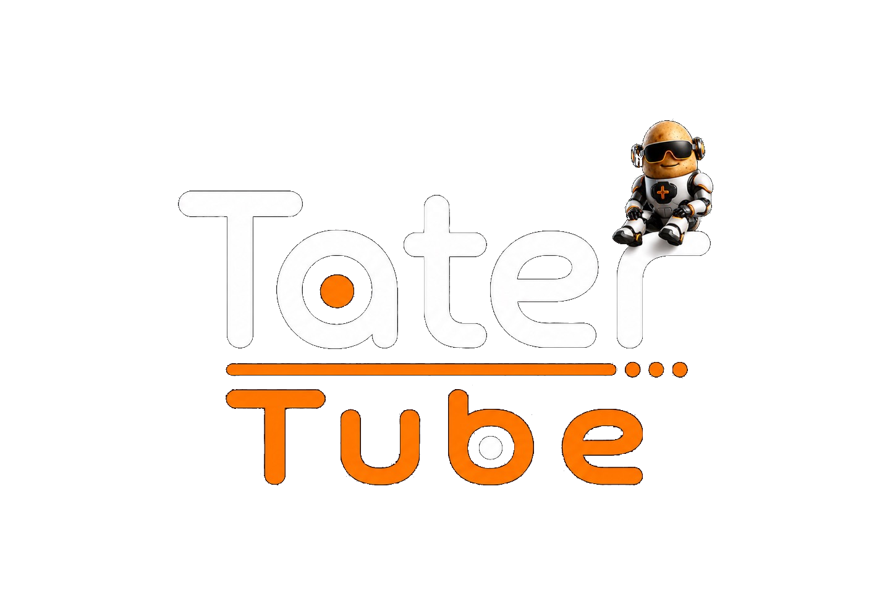

<p align="center">
  
</p>

# Tater Tube

Tater Tube is a retro VCR-style media frontend for Raspberry Pi appliance builds.

This fork is focused on two appliance-style setups:

- Raspberry Pi 4 with CRT display over composite output
- Raspberry Pi 5 with HDMI output using the display's preferred EDID mode
- Ready-to-flash SD card images
- Boot screen and automatic launch straight into Tater Tube
- Argon IR remote support through a GPIO IR receiver on GPIO23
- Local Emby/Jellyfin or Plex browsing and playback
- Emby/Jellyfin or Plex music playback through the Tape Deck module
- HDHomeRun Over The Air playback
- YouTube playlist playback through Public Access
- Newsgroups browsing and streaming through the Usenet module
- Game Center ROM browsing from RetroNAS/MiSTer shares with clean RetroArch game launch
- PC Link game streaming from Sunshine/Moonlight hosts
- Bluetooth controller pairing from Settings
- NTSC composite, PAL composite, and Pi 5 HDMI auto image builds

The easiest way to use it is to download the ready-to-flash `.img.xz` for your display from the latest GitHub release, flash it to an SD card, and boot the Pi.

## Features

### Video on Demand
- Local Emby/Jellyfin server sign in
- Plex PIN sign in with a code shown on the CRT and entered at `https://plex.tv/link`
- Movies, TV Shows, and Other Videos library browsing
- Resume playback, with Continue Watching for Emby/Jellyfin
- Autoplay next episode
- Playlist and Collection support for Emby/Jellyfin
- TV Mode builds extra movie, cartoon, genre, and decade channels when library metadata is available
- Audio and subtitle track selection
- H.264/AAC transcode playback with display-adaptive Auto plus 4K, 1440p, 1080p, 720p, and 480p quality targets

### Tape Deck
- Streams music from Emby/Jellyfin or Plex music libraries
- Shows each album as its own tape for easier browsing
- Cassette-deck playback screen
- Lightweight old-school VU meter visuals
- Next track uses a short tape-style fast-forward effect before starting
- Album track list browsing with play/pause and next/previous track controls

### Over The Air
- Connects directly to HDHomeRun tuners
- Opens directly into TV playback, no guide screen
- Up/down changes channels while video is playing
- Old-TV channel overlay inside mpv

### Public Access
- Plays saved public YouTube playlists
- Accepts a full playlist URL or just the playlist `list` code
- Looks up playlist names when available
- Shows each video in the VHS-style list
- Uses mpv with yt-dlp streaming, defaulting to CRT-friendly 360p
- Optional autoplay next video

### Usenet
- Connects to a Newznab-compatible indexer
- Browses media-only category groups for movies, TV, and music
- Keeps category folders grouped instead of flattening everything into one list
- Includes Newsgroups search from the main Usenet menu
- Supports larger browse limits of 50, 100, 250, or 500 results
- Streams selected NZBs through an AltMount/Stremio-compatible streaming service
- Supports provider-backed trending for movies and TV
- Trending views include today, week, month, and year
- Trending uses the normal Newznab API key plus any provider-specific account setting required by that provider

### Game Center
- Connects to a RetroNAS share using the MiSTer `games` folder layout
- Shows only systems with a supported installed RetroArch core and matching ROM folder
- Supports NES, Master System, Genesis, Game Boy, Game Boy Color, Game Boy Advance, SNES, and PlayStation when the matching cores are available
- Launches games directly into RetroArch with no RetroArch menu browsing
- Remote Home stops RetroArch and returns to the Tater Tube menu
- Bluetooth controllers can be paired from Settings and then used by SDL/RetroArch
- VHS-style controller mapper saves one global RetroPad layout for all cores

### PC Link
- Pairs with Sunshine hosts through Moonlight PIN setup
- Lists Sunshine apps from the host and caches them for faster launch
- Defaults to a CRT-friendly `640x480`, `15 FPS`, `1000 Kbps`, H.264 stream
- Includes CRT, HD, 1440p, and 4K stream presets up to `3840x2160`
- The stream resolution is requested by Tater Tube; the host desktop or game should also be set to a matching 4:3 resolution in Sunshine or the game settings
- Controller streaming needs host-side virtual gamepad support. Sunshine on Windows requires ViGEmBus; Sunshine on macOS currently does not support gamepads

### Local Files
- Browse folders on the Pi
- Play common video formats
- `m3u` and `m3u8` playlist support
- Loop and shuffle playback

### Appliance Image
- Boots straight into Tater Tube
- Separate NTSC composite, PAL composite, and Pi 5 HDMI auto images
- Tater Tube image boot screen
- SSH enabled for debugging
- Argon IR remote defaults
- Argon ONE fan Auto, Off, and fixed-speed settings
- GPIO IR receiver default: GPIO23, physical pin 16
- Analog audio defaults for the Pi composite/3.5mm setup
- HDMI/KMS defaults for the Pi 5 auto-resolution setup
- RetroArch and RetroNAS mount support
- yt-dlp support for Public Access playlist streaming
- Newznab and AltMount/Stremio settings for Usenet streaming
- Bluetooth controller support through BlueZ

### Controls
- Keyboard navigation
- USB remote/controller navigation
- Bluetooth controller navigation after pairing
- Global controller mapper for Tater Tube navigation and RetroArch cores
- Argon IR remote support
- Media keys during playback
- Local HTTP playback and launch API for companion apps

### Local Control API

Tater Tube includes a small HTTP API for companion apps and voice-assistant bridges. It is enabled by default on the Pi image at port `24024`.

```bash
curl http://240mp.local:24024/api/v1/status
```

Useful endpoints:

```text
GET  /api/v1/status
POST /api/v1/player/play-pause
POST /api/v1/player/pause
POST /api/v1/player/resume
POST /api/v1/player/stop
POST /api/v1/player/seek          {"position_ms": 60000} or {"offset_ms": 30000}
POST /api/v1/player/skip-forward  {"offset_ms": 30000}
POST /api/v1/player/skip-back     {"offset_ms": -10000}
POST /api/v1/player/volume-up
POST /api/v1/player/volume-down
POST /api/v1/player/mute
POST /api/v1/player/key           {"key": "LEFT", "repeat": 1}
POST /api/v1/library/search       {"query": "batman", "types": ["movie", "show", "game"], "limit": 10}
POST /api/v1/library/launch       {"id": "vod:movie:ITEM_ID"}
```

Search results include normalized IDs such as `vod:movie:...`, `vod:show:...`, and `game:nes:...`. Pass the selected result `id` back to `/api/v1/library/launch` to start Video on Demand playback or a Game Center game.

Set `MP240_API_TOKEN` to require `Authorization: Bearer <token>` or `X-240MP-Token: <token>`. See [INSTALL.md](INSTALL.md#local-control-api) for the full API settings.

## Install

- [Flash the ready-to-flash Raspberry Pi image](INSTALL.md#flash-the-ready-to-flash-image)
- [Build a custom image](INSTALL.md#build-a-custom-image)
- [Development builds](BUILDING.md)

## Hardware Target

This project targets Raspberry Pi appliance builds: Pi 4 composite output for CRTs, plus a Pi 5 HDMI auto-resolution image for modern displays. Media modules cover Emby/Jellyfin, Plex, HDHomeRun OTA, YouTube playlists, Usenet streaming, RetroNAS-backed games, and Sunshine/Moonlight PC Link.

## License

This project is licensed under the GNU General Public License v3.0. See [LICENSE](LICENSE) for the full text.

You are free to use, study, and modify this code. If you distribute a modified version, you must also distribute it under GPL-3.0 and make the source available.

## Credits

Tater Tube started as a fork of [anthonycaccese/240-MP](https://github.com/anthonycaccese/240-MP). This fork is focused on appliance-style Pi images, Emby/Jellyfin and Plex support, HDHomeRun OTA, Public Access playlists, Usenet streaming, RetroNAS games, PC Link, and Argon IR defaults.
